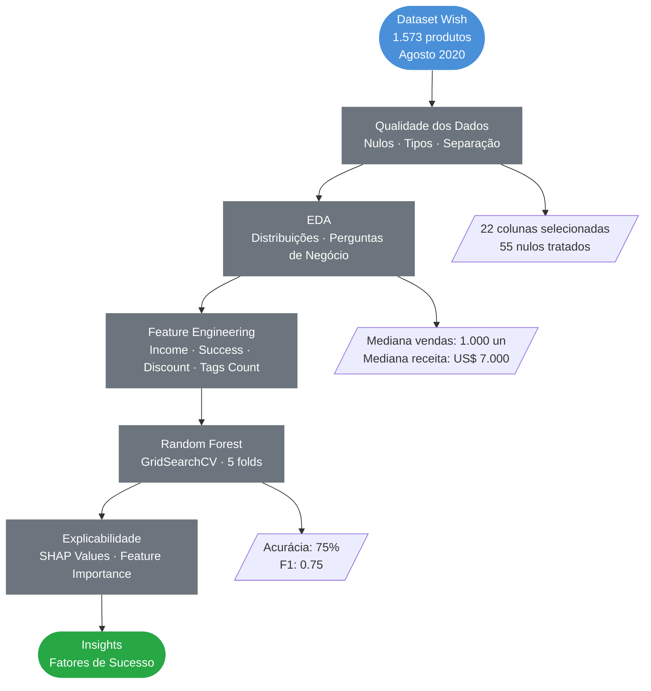
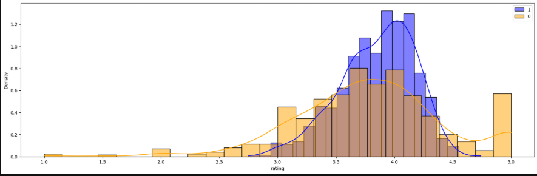
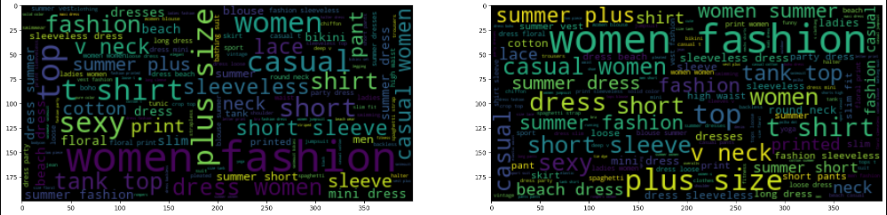
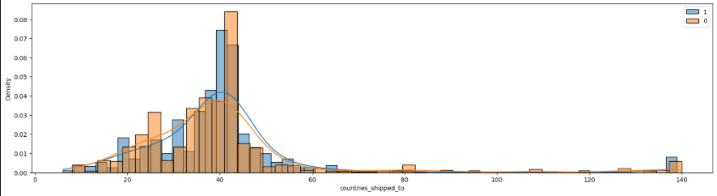
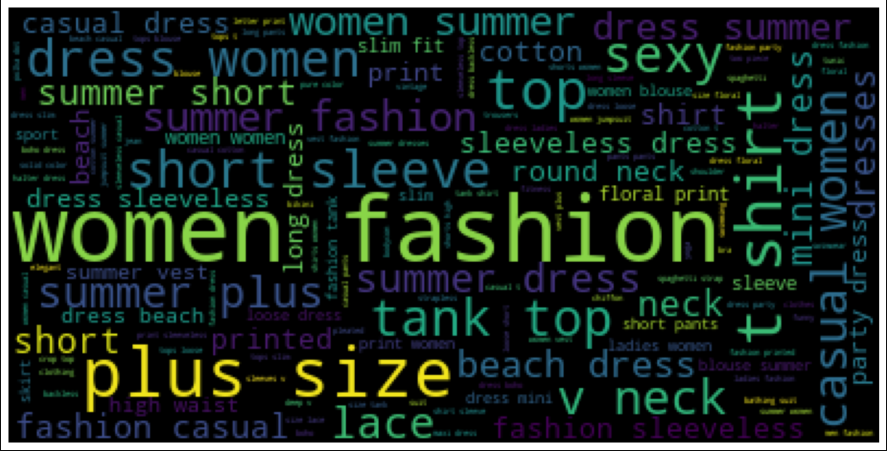
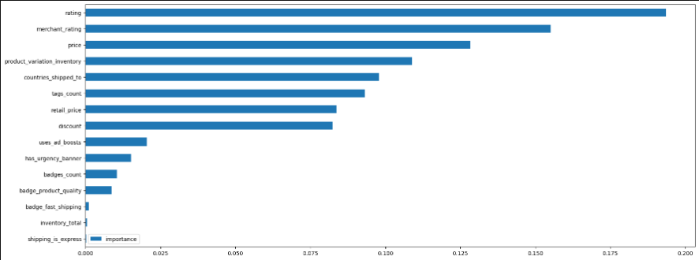
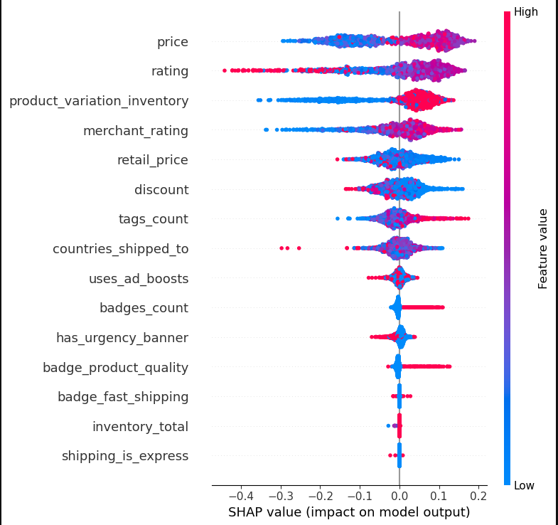

<div align="center">

# Análise de Produtos de Verão — Wish
### EDA · Classificação · Random Forest · GridSearchCV · SHAP

<br>

[](https://www.python.org/)
[](https://pandas.pydata.org/)
[](https://scikit-learn.org/)
[](https://shap.readthedocs.io/)
[]()

<br>

> Análise completa de produtos de verão da plataforma Wish para identificar os fatores que
> determinam o sucesso de vendas, combinando EDA, perguntas de negócio e Random Forest com SHAP.

</div>

---

## Índice

- [Contexto](#contexto)
- [Perguntas de Negócio](#perguntas-de-negócio)
- [Pipeline do Projeto](#pipeline-do-projeto)
- [Tecnologias](#tecnologias-utilizadas)
- [Dataset](#dataset)
- [Etapas Detalhadas](#etapas-detalhadas)
- [Principais Resultados](#principais-resultados)
- [Modelo de Machine Learning](#modelo-de-machine-learning)
- [Estrutura do Repositório](#estrutura-do-repositório)
- [Autor](#autor)

---

## Contexto

A plataforma **Wish** é um marketplace global de produtos de baixo custo. Com milhares de produtos competindo pela atenção dos consumidores, entender **o que diferencia produtos campeões de vendas dos demais** é uma vantagem estratégica enorme para vendedores.

Neste projeto, analisei um dataset real de produtos de verão da Wish para responder perguntas de negócio concretas e construir um modelo preditivo de sucesso de vendas.

| Definição de Sucesso | Critério |
|---|---|
| **Produto bem sucedido** (`success = 1`) | Receita estimada (`price × units_sold`) acima da mediana — **> US$ 7.000** |
| **Produto sem sucesso** (`success = 0`) | Receita estimada abaixo da mediana |

---

## Perguntas de Negócio

As perguntas que guiaram a análise exploratória:

- Produtos com maior desconto em relação ao preço original vendem mais?
- Ad boosts aumentam as vendas?
- Avaliações melhores levam a mais vendas?
- Badges de qualidade e frete rápido impactam o desempenho?
- Quantidade de tags influencia as vendas?
- Frete expresso faz diferença nos resultados?

---

## Pipeline do Projeto



---

## Tecnologias Utilizadas

| Tecnologia | Uso no Projeto |
|---|---|
|  | Linguagem principal |
|  | Manipulação e análise dos dados |
|  | Cálculos numéricos e quantis |
|  | Visualizações e gráficos |
|  | Histogramas e análises comparativas |
|  | Random Forest e GridSearchCV |
|  | Explicabilidade do modelo (XAI) |
|  | Análise visual de tags |

---

## Dataset

**Fonte:** [Summer Products with Rating and Performance — Kaggle](https://www.kaggle.com/)
**Período:** Agosto de 2020

| Característica | Detalhe |
|---|---|
| Volume | 1.573 produtos |
| Colunas originais | 43 |
| Colunas selecionadas para análise | 22 |
| Nulos tratados | 55 registros (product_color, size, urgency_banner, origin_country) |
| Variável alvo | `success` (0 ou 1) — definida pela mediana de receita |

**Estatísticas do dataset:**

| Métrica | Valor |
|---|---|
| Preço médio | US$ 8,33 |
| Preço de varejo médio | US$ 23,29 |
| Mediana de unidades vendidas | 1.000 un |
| Média de unidades vendidas | 4.339 un |
| Mediana de receita estimada | **US$ 7.000** |
| Média de receita estimada | US$ 35.212 |
| Rating médio | 3,82 ⭐ |

---

## Etapas Detalhadas

**Qualidade dos Dados**

- Seleção de 22 colunas relevantes das 43 originais
- Tratamento de nulos via preenchimento por string vazia (colunas categóricas)
- Separação de colunas numéricas e categóricas via `describe()`
- Padronização de `units_sold`: valores abaixo de 10 normalizados para 10

**Feature Engineering**

| Feature criada | Lógica |
|---|---|
| `income` | `price × units_sold` — receita estimada do produto |
| `success` | `1` se `income > 7.000` (mediana), `0` caso contrário |
| `discount` | `retail_price - price` — valor do desconto aplicado |
| `tags_count` | `len(tags.split(","))` — número de tags do produto |

**EDA — Perguntas de Negócio**

Cada pergunta foi investigada comparando a distribuição de produtos `success=1` vs `success=0`.

---

## Principais Resultados

### Avaliações importam para as vendas?



> Sim — produtos bem-sucedidos concentram avaliações acima de **3,5 estrelas**, enquanto produtos com menos vendas apresentam distribuição mais dispersa e pior. Avaliação é um fator relevante para o sucesso.

---

### Quantidade de tags influencia as vendas?



> Produtos com **mais tags tendem a vender mais**. A maior densidade de tags aumenta a descoberta orgânica do produto na plataforma — uma estratégia simples com impacto real nas vendas.

---

### Desconto em relação ao preço original importa?



> A distribuição de descontos é similar entre os dois grupos — o desconto **isoladamente não é um diferencial determinante** para o sucesso. O preço absoluto (já baixo na Wish) parece ser mais relevante que a diferença em relação ao varejo.

---

### Tags dos produtos campeões de venda



> As tags mais frequentes em produtos bem sucedidos são: **Women's Fashion, Summer, Fashion, Women, Casual**. Produtos que combinam apelo de moda feminina com sazonalidade de verão dominam o top de vendas.

**Top 5 tags — produtos de sucesso vs. sem sucesso:**

| Ranking | Tags — Sucesso | Tags — Sem Sucesso |
|---|---|---|
| 1º | Women's Fashion (665) | Summer (741) |
| 2º | Summer (580) | Women's Fashion (650) |
| 3º | Fashion (527) | Fashion (555) |
| 4º | Women (504) | Casual (476) |
| 5º | Casual (429) | Women (457) |

> A tag **"Women's Fashion"** aparece mais nos produtos de sucesso do que nos sem sucesso — sinal de que o posicionamento voltado para moda feminina é mais eficiente.

---

### Ad Boosts e Badges — surpreendem!

| Fator | Produtos Sem Sucesso | Produtos Com Sucesso | Conclusão |
|---|---|---|---|
| **Ad Boost ativado** | 368 de 809 (45%) | 313 de 764 (41%) | Ad boost **não garante** sucesso |
| **Badge Qualidade** | 39 de 809 (5%) | 78 de 764 (10%) | Badge de qualidade aparece mais em sucessos |
| **Frete Expresso** | 14 de 809 | 6 de 764 | Frete expresso **não influencia** |

---

## Modelo de Machine Learning

**Random Forest Classifier** com otimização via **GridSearchCV (5 folds)**

### Feature Importances



> As variáveis numéricas contínuas — como `rating_count`, `merchant_rating_count`, `price` e `units_sold` — dominam as importâncias do modelo, confirmando que volume e reputação são os principais sinais preditivos.

---

### Explicabilidade com SHAP Values



> O SHAP summary plot mostra o impacto individual de cada feature nas predições. Valores altos de `rating_count` e `merchant_rating_count` **empurram fortemente o modelo para prever sucesso** — confirmando que reputação acumulada é o fator mais decisivo, acima do preço.

---

### Métricas de Avaliação

| Métrica | Classe 0 (sem sucesso) | Classe 1 (sucesso) | Média |
|---|---|---|---|
| **Precision** | 0.76 | 0.75 | 0.75 |
| **Recall** | 0.78 | 0.72 | 0.75 |
| **F1-score** | 0.77 | 0.73 | 0.75 |
| **Accuracy** | — | — | **75%** |

**Matriz de Confusão:**
```
                    Previsto: 0    Previsto: 1
Real: 0 (sem sucesso)    196           54
Real: 1 (com sucesso)     63          159
```

### Próximos Passos Sugeridos

- Testar XGBoost e LightGBM para comparação de desempenho
- Aplicar NLP nas colunas `title` e `tags` para extrair features textuais mais ricas
- Criar um score de atratividade composto para ranquear produtos antes do lançamento
- Analisar sazonalidade — comparar datasets de outras épocas do ano

---

## Estrutura do Repositório

```
analise-de-produtos-de-verao-wish/
│
├── 📁 assets/                              # Gráficos gerados na análise
│   ├── avaliacao_sucesso_vs_falha.png
│   ├── contagem_de_tags_sucesso_vs_falha.png
│   ├── desconto_sucesso_vs_falha.png
│   ├── feature_importances.png
│   ├── grafico_resumo_shap.png
│   └── wordcloud_tags_sucesso.png
│
├── 📓 analise-de-vendas-wish.ipynb         # Notebook completo
├── 📄 summer-products-with-rating-and-performance_2020-08.csv  # Dataset
├── 📄 requirements.txt                     # Dependências do projeto
└── 📄 README.md                            # Documentação do projeto
```

---

## Autor

<div align="center">


**Anderson Coelho**
*Cientista de Dados*

[](https://www.linkedin.com/in/anderson-coelho-42671634a/)
[](https://github.com/Anderson1999DC)

</div>

---

<div align="center">

</div>
