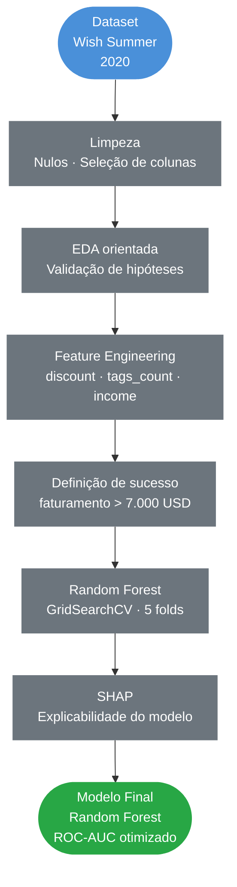

# Análise de Vendas de Produtos de Verão Wish

### EDA · Classificação · Random Forest · SHAP · GridSearchCV

&nbsp;

[](https://www.python.org/)
[](https://pandas.pydata.org/)
[](https://scikit-learn.org/)
[](https://shap.readthedocs.io/)
[](https://github.com/Anderson1999DC/analise-de-produtos-de-verao-wish)

&nbsp;
> Análise exploratória e modelo preditivo para identificar os fatores que determinam
> o sucesso comercial de produtos de verão na plataforma Wish com explicabilidade via SHAP.

---

## Índice

- [Contexto](#contexto)
- [Objetivos](#objetivos)
- [Perguntas de Negócio](#perguntas-de-negócio)
- [Pipeline do Projeto](#pipeline-do-projeto)
- [Tecnologias](#tecnologias-utilizadas)
- [Dataset](#dataset)
- [Análise Exploratória](#análise-exploratória)
- [Machine Learning](#machine-learning)
- [Principais Resultados](#principais-resultados)
- [Estrutura do Repositório](#estrutura-do-repositório)
- [Autor](#autor)

---

## Contexto

Projeto de análise de dados e Machine Learning aplicado ao e-commerce, utilizando dados reais de produtos de verão vendidos na plataforma Wish em 2020. O objetivo é entender quais fatores determinam o sucesso comercial de um produto no marketplace, combinando análise exploratória orientada por hipóteses com Random Forest e explicabilidade via SHAP.

| Etapa | Descrição |
|---|---|
| **EDA orientada** | Validação de hipóteses de negócio via análise visual |
| **Feature Engineering** | Criação de `discount`, `tags_count` e `income` |
| **Modelagem** | Random Forest otimizado via GridSearchCV |
| **Explicabilidade** | SHAP para entender o impacto de cada variável |

---

## Objetivos

- Identificar os fatores que mais influenciam o sucesso de produtos na Wish
- Responder perguntas de negócio com análise exploratória orientada por hipóteses
- Construir um modelo preditivo de classificação (sucesso vs. sem sucesso)
- Usar SHAP para explicar as previsões individuais do modelo
- Exportar o modelo treinado para deploy via API

---

## Perguntas de Negócio

As seguintes hipóteses foram investigadas durante a análise:

| # | Hipótese |
|---|---|
| 1 | Produtos com maior desconto percebido vendem mais? |
| 2 | Ad boosts aumentam as vendas? |
| 3 | Avaliações melhores aumentam vendas? |
| 4 | Badges de qualidade e envio rápido importam? |
| 5 | Quantidade de tags auxilia vendas? |
| 6 | Quais tags estão associadas a produtos de sucesso? |
| 7 | Produtos com mais países de entrega vendem mais? |

---

## Pipeline do Projeto



---

## Tecnologias Utilizadas

| Tecnologia | Uso no Projeto |
|---|---|
|  | Linguagem principal |
|  | Manipulação e análise dos dados |
|  | Operações numéricas |
|  | Random Forest e GridSearchCV |
|  | Visualizações e gráficos |
|  | Histogramas e análises comparativas |
|  | Explicabilidade do modelo |
|  | Visualização de tags por sucesso |

---

## Dataset

**Fonte:** [Summer Products and Sales in E-Commerce Wish](https://www.kaggle.com/datasets/jmmvutu/summer-products-and-sales-in-ecommerce-wish) Kaggle  
**Uso:** Exclusivamente educacional

| Característica | Detalhe |
|---|---|
| Volume | ~1.573 produtos |
| Período | Agosto de 2020 |
| Variável target | `success` faturamento > $7.000 |
| Features selecionadas | 22 colunas originais |
| Features criadas | `discount`, `tags_count`, `income` |

---

## Análise Exploratória

### Avaliações e Sucesso


> Produtos com melhores avaliações tendem consistentemente a vender mais **prova social é o principal driver de conversão na Wish**.

### Quantidade de Tags e Alcance


> Produtos com mais tags têm maior discoverabilidade na plataforma o algoritmo de busca da Wish favorece produtos mais tagueados.

### Tags dos Produtos de Sucesso


> Wordcloud comparativo: os termos mais frequentes nos produtos campeões de venda vs. produtos sem sucesso revela as categorias e nichos com maior demanda.

### Análise de Logística


> Produtos com cobertura em mais países de entrega apresentam correlação com maiores volumes de venda alcance global amplia o mercado potencial.

---

## Machine Learning

### Features Mais Importantes


### Explicabilidade com SHAP


> O SHAP mostra não apenas **quais** features importam, mas **como** cada valor influencia a previsão. Pontos vermelhos à direita aumentam a probabilidade de sucesso; à esquerda, diminuem.

### Otimização com GridSearchCV

| Parâmetro | Valores Testados |
|---|---|
| `n_estimators` | 100, 200, 300 |
| `max_features` | 2, 4, 6, 8 |
| `bootstrap` | True, False |

---

## Principais Resultados

**Fatores que mais determinam o sucesso de um produto na Wish:**

| # | Fator | Insight |
|---|---|---|
| 1 | **Rating e volume de avaliações** | Prova social é o principal driver de conversão |
| 2 | **Desconto percebido** | Diferença entre retail_price e price influencia a conversão |
| 3 | **Quantidade de tags** | Mais tags = maior discoverabilidade orgânica |
| 4 | **Cobertura geográfica** | Mais países atendidos = maior mercado potencial |
| 5 | **Ad boosts** | Efeito positivo mas não determinante qualidade supera publicidade |
| 6 | **Badges** | Contribuem para confiança mas não garantem vendas isoladamente |

**Aplicações do modelo:**
- Score de probabilidade de sucesso para novos produtos antes do lançamento
- Apoio a vendedores na otimização de listagens
- Identificação de nichos e tags estratégicas por categoria

---

## Estrutura do Repositório

```
analise-de-produtos-de-verao-wish/
│
├──  assets/                                  # Gráficos gerados na análise
│   ├── distribuicao_avaliacao_por_sucesso.png
│   ├── distribuicao_quantidade_de_tags.png
│   ├── feature_importance_wish.png
│   ├── SHAP.png
│   ├── shipping_analysis.png
│   └── tags_sucesso.png
│
├──  analise_de_vendas_wish_restrutured.ipynb # Notebook completo
├──  summer-products-with-rating-and-performance_2020-08.csv
├──  modelo_wish_success.pkl                  # Modelo Random Forest treinado
├──  colunas_wish.pkl                         # Features esperadas pela API
├──  requirements.txt                         # Dependências do projeto
└──  README.md                                # Documentação do projeto
```

---

## Autor

<div align="center">


**Anderson Coelho**
*Cientista de Dados*

[](https://www.linkedin.com/in/anderson-coelho-42671634a/)
[](https://github.com/Anderson1999DC)

</div>

---

<div align="center">

</div>
